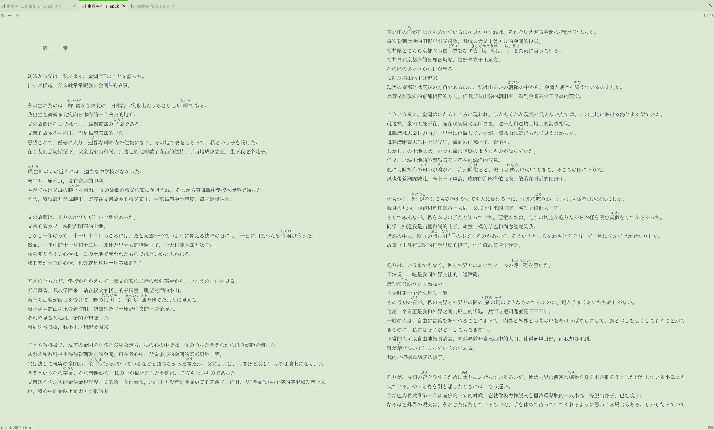
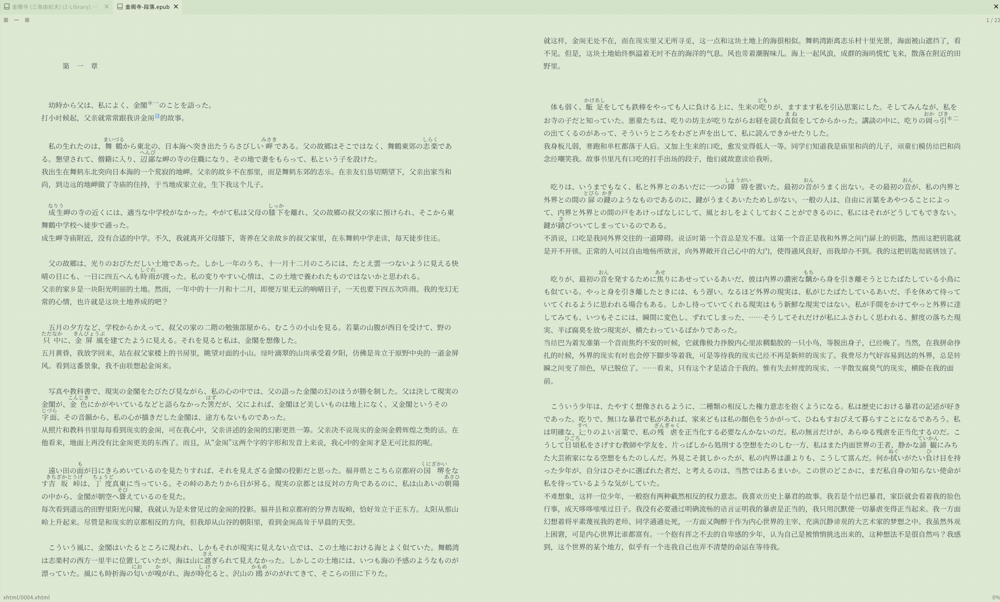
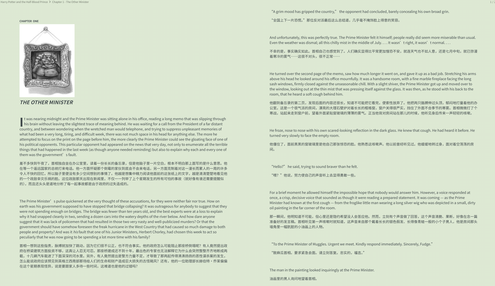

# BookAlign

BookAlign 用来把一本外语原著 EPUB 和它的正式译本 EPUB 做结构化对齐，再重建成适合对照阅读的双语 EPUB。

它不是机翻工具。它做的是：

1. 从原著和译本里抽取正文句段。
2. 用 embedding + 动态规划做整体对齐。
3. 保留原书结构，把译文按句子或段落回写到原文 EPUB 里。

当前项目主要面向小说阅读场景，尤其是日语原著配中文译本，也支持英语、西语等语言的基本流程。

## 适合什么场景

- 想对照读文学原著，但不想在两个阅读器之间来回切换。
- 想保留正式译本，而不是依赖机翻。
- 想把对齐结果存成 JSON，后续单独调试 builder 或阅读样式。

## 效果展示

下面这三张图分别展示《金阁寺》句子级、《金阁寺》段落级，以及《哈利波特》段落级的阅读效果。

- `docs/images/kinkaku-inline.png`
- `docs/images/kinkaku-paragraph.png`
- `docs/images/harry-potter-paragraph.png`





## 安装

项目使用 Python 3.12 和 `uv`。

安装基础依赖：

```bash
uv sync --group dev
```

安装对齐运行时依赖：

```bash
uv sync --group dev --group align
```

如果你本地已经有 LaBSE，可以直接把模型路径传给 CLI，例如 `/root/model/LaBSE`。

## 快速开始

最常用的一条命令：

```bash
uv run bookalign \
  "books/金閣寺 (三島由紀夫) (Z-Library).epub" \
  "books/金阁寺 (三岛由纪夫) (Z-Library).epub" \
  "out/金阁寺-段落.epub" \
  --source-lang ja \
  --target-lang zh \
  --model-name /root/model/LaBSE
```

这条命令默认就是：

- `builder-mode=source_layout`
- `writeback-mode=paragraph`
- `layout-direction=horizontal`
- `device=cuda`

如果你想输出更密集的句子级交错阅读版本：

```bash
uv run bookalign \
  "books/金閣寺 (三島由紀夫) (Z-Library).epub" \
  "books/金阁寺 (三岛由纪夫) (Z-Library).epub" \
  "out/金阁寺-句子.epub" \
  --source-lang ja \
  --target-lang zh \
  --model-name /root/model/LaBSE \
  --writeback-mode inline
```

如果你想先保存对齐结果 JSON，后面只调 builder：

```bash
uv run bookalign \
  "books/金閣寺 (三島由紀夫) (Z-Library).epub" \
  "books/金阁寺 (三岛由纪夫) (Z-Library).epub" \
  "out/金阁寺-段落.epub" \
  --source-lang ja \
  --target-lang zh \
  --model-name /root/model/LaBSE \
  --alignment-json-output "out/金阁寺.json"
```

后续可直接从 JSON 重建：

```bash
uv run bookalign \
  "books/金閣寺 (三島由紀夫) (Z-Library).epub" \
  "books/金阁寺 (三岛由纪夫) (Z-Library).epub" \
  "out/金阁寺-重建.epub" \
  --source-lang ja \
  --target-lang zh \
  --alignment-json-input "out/金阁寺.json"
```

## 当前特性

- 保留原书 spine 顺序和大部分正文结构。
- 支持 `paragraph` 和 `inline` 两种回写方式。
- 保存 `AlignmentResult` 为 JSON，方便复用和调试。
- 对目录、注释、前后附文等非正文做保留，不直接混入正文对齐。
- 支持把目标侧未匹配章节保存在 JSON 中，并单独写入附录页。
- 修复脚注引用与回跳，避免注释页成为死链接。

## 已知限制

- 目前最稳定的组合仍然是日语小说 / 英语小说 -> 中文译本。
- EPUB 本身的格式质量影响很大，脏 TOC、异常脚注、碎片化 XHTML 都会拖累效果。
- `inline` 模式对 source EPUB 结构要求更高，不如 `paragraph` 稳。
- 诗歌、公式、图注、图文混排页面目前不是重点优化对象。
- 依赖 LaBSE 一类多语模型，显存与启动成本高于普通脚本工具。

## 仓库结构

```text
bookalign/
├── align/      # 对齐抽象与 Bertalign 适配
├── epub/       # EPUB 读取、抽取、CFI、builder
├── models/     # Segment / AlignmentResult 等共享模型
├── cli.py      # 命令行入口
└── pipeline.py # 端到端编排

docs/           # README 配图与补充文档
examples/       # 示例目录说明
scripts/        # 少量环境与运行时辅助脚本
tests/          # pytest
```

## 文档

- [技术细节、实现说明、不足与后续方向](TECHNICAL.md)

## Acknowledgements

这个项目直接受益于下面这些开源项目：

- [Flow](https://github.com/pacexy/flow)：一个很轻量的阅读器，我在 README 和演示里使用的效果图就是用它渲染的。
- [Vecalign](https://github.com/thompsonb/vecalign)：我最早是从这个项目开始系统了解“文本对齐算法”这条路线的。
- [Bertalign](https://github.com/bfsujason/bertalign)：当前 BookAlign 实际使用的对齐后端，可以理解为对 Vecalign 思路的进一步工程化和改进。
- [calibre](https://github.com/kovidgoyal/calibre)：提供了 EPUB CFI 相关的重要实现参考，尤其是 Python 侧的规范解析思路。

## 开发

运行测试：

```bash
uv run pytest
```

只跑抽取相关测试：

```bash
uv run pytest tests/test_splitter.py tests/test_extractor.py -q
```

## 未来方向

- 做成阅读器插件或阅读器内核，而不是只做离线 EPUB 合并。
- 改善更多语言对、更多 EPUB 风格下的分句和章节匹配。
- 为局部错位窗口增加更稳的自动修正策略。
- 给 builder 加更好的排版控制，例如缩进、段间距、注释样式和阅读器兼容策略。
